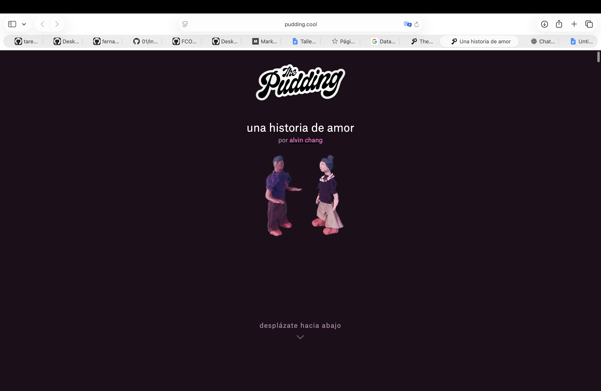
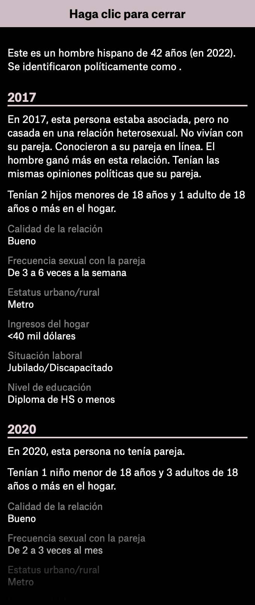
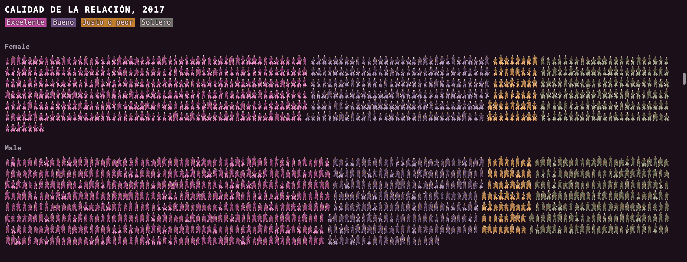
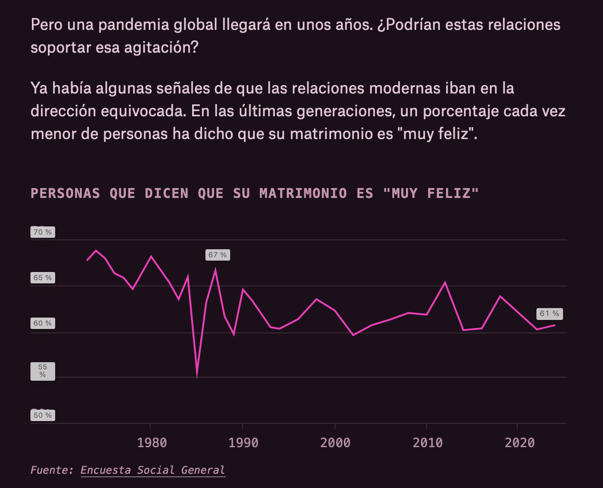
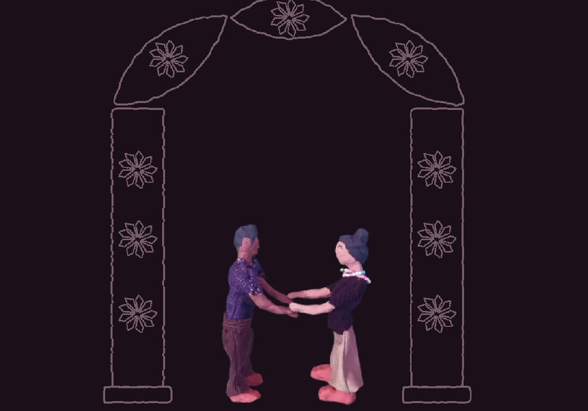
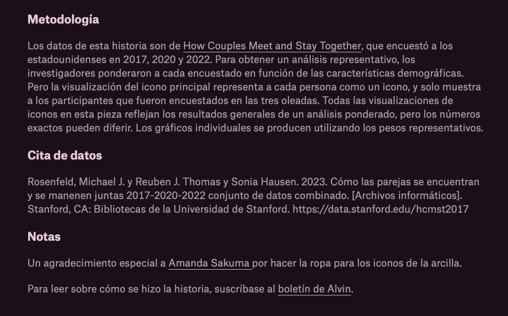

# Análisis de “A love story” — The Pudding

**Webstory:** *A love story*
**Autor:** Alvin Chang
**Medio:** The Pudding
**URL:** https://pudding.cool/2026/06/love-story/

## Descripción de la historia

*A love story* es una webstory de The Pudding que explora cómo han cambiado las relaciones de pareja y cómo estas se vieron afectadas por la pandemia de COVID-19.

La investigación principal utiliza datos del estudio *How Couples Meet and Stay Together*, realizado por investigadores de Stanford a partir de encuestas realizadas en 2017, 2020 y 2022. La webstory se concentra en las personas que participaron en las tres etapas de la encuesta.

Uno de los principales resultados es que la pandemia tuvo efectos diferentes según la calidad previa de las relaciones. Las parejas que tenían relaciones consideradas excelentes tuvieron mayores probabilidades de señalar que estas habían mejorado, mientras que aquellas que ya presentaban dificultades tendieron a deteriorarse aún más.

## Estructura narrativa

La estructura narrativa es progresiva. La webstory comienza con la historia de Henry y Mary, lo que permite introducir el tema desde una situación cotidiana y fácil de reconocer. A partir de ahí, el relato va ampliando el foco y utiliza datos para mostrar cómo han cambiado las relaciones de pareja a lo largo del tiempo, por ejemplo, las formas en que las personas se conocen y algunos cambios relacionados con el matrimonio.

Después la historia llega a la pandemia, que funciona como un momento de quiebre y permite observar qué pasó con distintos tipos de relaciones. Finalmente, los datos vuelven a enfocarse en las diferencias entre las parejas y buscan explicar por qué algunas relaciones se mantuvieron o incluso mejoraron, mientras que otras empeoraron.

La historia de Henry y Mary funciona como el hilo conductor que conecta los datos con una experiencia más personal, haciendo que el análisis estadístico no se sienta como una serie de gráficos independientes.

## Visualización e interacción

La webstory utiliza principalmente **scrollytelling**, por lo que la información aparece progresivamente a medida que el usuario avanza por la página. Esto ayuda a controlar la cantidad de información que recibe el lector y mantiene un ritmo constante durante la lectura.

Una de las visualizaciones que más me llamó la atención es la representación de los participantes mediante **íconos de personas**. En vez de mostrar solamente porcentajes o tablas, cada participante aparece representado visualmente y el usuario puede hacer clic sobre ellos para conocer más información. Esto permite relacionar los resultados generales con casos individuales.

También se utiliza el **color** para diferenciar grupos y facilitar las comparaciones. Gracias a estos colores es posible identificar rápidamente las diferencias entre las respuestas de los participantes, sin tener que revisar cada dato numérico.

En otras partes se utilizan **gráficos de líneas** para mostrar cambios a través del tiempo. Este recurso resulta apropiado porque permite identificar tendencias y relacionarlas con distintos períodos históricos.

También se utilizan **ilustraciones** de Henry y Mary, que ayudan a mantener la continuidad de la historia y sirven como transición entre las distintas partes del reportaje.

## Uso y calidad de los datos

La webstory señala que la principal fuente es *How Couples Meet and Stay Together*, estudio que encuestó a estadounidenses en 2017, 2020 y 2022.

La metodología se explica al final de la historia, lo que permite conocer el origen de los datos y algunas de sus limitaciones. Esto es importante porque las visualizaciones representan los datos de una manera determinada y no necesariamente corresponden de forma exacta a todos los resultados del estudio original.

Creo que la transparencia sobre las fuentes y la metodología aumenta la credibilidad del reportaje, ya que permite al lector entender de dónde proviene la información que se está presentando.

## Equilibrio entre texto, imágenes y datos

Los distintos recursos cumplen funciones diferentes. El texto entrega contexto y explica los resultados, mientras que las visualizaciones permiten observar los datos de una manera más directa.

El equilibrio entre ellos está bien logrado. Los textos son relativamente breves y se intercalan con gráficos, ilustraciones y elementos interactivos. Esto hace que la lectura sea más dinámica y entretenida.

## Evaluación de su efectividad

Considero que *A love story* es un buen ejemplo de periodismo de datos porque logra combinar una historia personal con información estadística sin que ninguna de las dos partes quede desplazada.

Además, la webstory consigue presentar información estadística de una manera clara y atractiva, lo que permite entender mejor un fenómeno que podría resultar difícil de explicar solamente mediante cifras.
